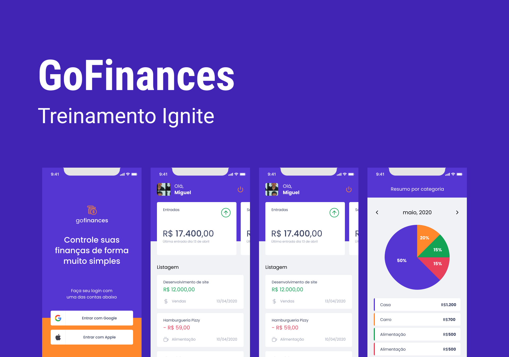

# 💬 GoFinances

Projeto desenvolvido no Ignite de React Native da Rocketseat.

 

 

<!-- ## 🟢 Experimente agora

Disponível [aqui](https://letmeask-pearl.vercel.app/).

 

## 🎥 Video de demosntração

  -->

## 🚀 Tecnologias

- ⚛️ [React Native](https://reactnative.dev/).
- 📚 [React Hook Form](https://react-hook-form.com/).
- 💅 [Styled-Components](https://styled-components.com/).

 

## 💻 Como usar

- **_Clone o projeto:_**  
  ` git clone https://github.com/lmiguelm/gofinances`

- **_Entre na pasta do projeto:_**  
  `cd gofinances`

- **_Baixe as dependências:_**  
  ` yarn || npm install`

- **_Rode o app:_**  
  `expo start`

 

<!-- ## 📝 Licença

Esse projeto está sob a licença MIT. Veja o arquivo [LICENSE](https://github.com/lmiguelm/Letmeask/blob/master/LICENSE.md) para mais detalhe -->
